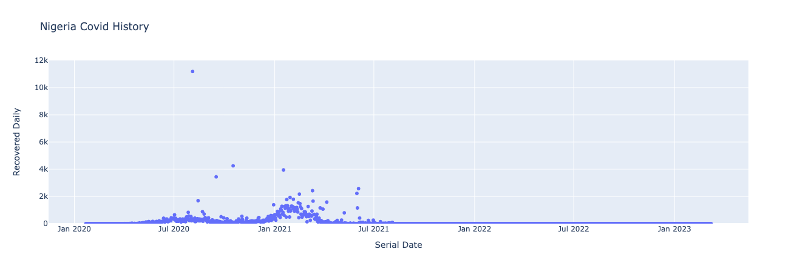

# Exploratory Data Analysis and Interactive Visualization for Covid-19 Cases in African Contries

This repository contains the code and data for the Exploratory Data Analysis and Interactive Visualization project. The project focuses on analyzing and visualizing Covid-19 incidence data from various African countries.

## Table of Contents

- [Exploratory Data Analysis and Interactive Visualization for Covid-19 Cases in African Contries](#exploratory-data-analysis-and-interactive-visualization-for-covid-19-cases-in-african-contries)
  - [Table of Contents](#table-of-contents)
  - [Introduction](#introduction)
  - [Data](#data)
  - [Analysis](#analysis)
  - [Visualization](#visualization)
  - [Conclusion](#conclusion)

## Introduction

In this project, we aim to explore and analyze Covid-19 incidence data from African countries to gain insights into the spread and impact of the virus. By performing exploratory data analysis and creating interactive visualizations, we can better understand the trends and patterns in the Covid-19 data.

## Data

The data used in this project is obtained from reliable sources, including government reports, international organizations, and research papers. It includes information on key indicators such as cases, deaths, recoveries, and more for each African country.

## Analysis

The analysis phase involves cleaning and preprocessing the data to ensure its quality and reliability. We then perform various statistical analyses to identify correlations, trends, and outliers in the data. This helps us uncover interesting insights and patterns that can contribute to a better understanding of the impact of Covid-19 in African countries.

## Visualization

To effectively communicate our findings, we create interactive visualizations using popular data visualization libraries such as Matplotlib, Seaborn, and Plotly. These visualizations provide a clear and intuitive representation of the data, allowing users to explore the trends and patterns interactively.

Some of the visualizations are shown below:

## Conclusion

Through this project, our goal is to gain valuable insights into the impact of Covid-19 in African countries. By conducting exploratory data analysis and creating interactive visualizations, we can uncover significant patterns and trends that can contribute to informed decision-making and policy formulation.

For more details, please refer to the [exploratory_data_analysis_and_interactive_visualization.ipynb](exploratory_data_analysis_and_interactive_visualization.ipynb) notebook.
